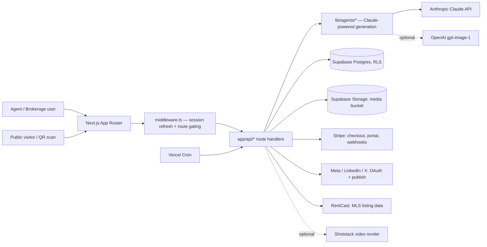

# Architecture

Describes the system as it exists today. Proposed changes belong in a decision record until they are built.

## System overview

A Next.js App Router application, hosted on Vercel, with Supabase providing Postgres (RLS-enforced multi-tenancy), authentication, and file storage. Claude-powered agents generate marketing copy and plan content calendars; a pluggable provider layer optionally adds AI image generation (OpenAI) and video rendering (Shotstack). Stripe handles subscription billing. A separate `ops-agents/` package (see `docs/decisions/0005-ops-agents-standalone-service.md`) is an internal Slack bot with no runtime dependency on the product app.


Source: `middleware.ts`, `app/api/**`, `lib/agents/*`, `vercel.json`

## Layers

| Layer | Responsibility | Location |
|---|---|---|
| Routing/UI | Pages, forms, client interactivity | `app/(app)/`, `app/l/`, `app/r/`, `components/` |
| API | Route handlers: validate input, call domain logic, return JSON | `app/api/` |
| Domain/agents | Business rules, AI generation prompts and parsing, compliance gating | `lib/agents/`, `lib/billing/`, `lib/branding/`, `lib/social/` |
| Data access | Supabase client construction, storage helpers | `lib/supabase/`, `lib/storage.ts` |
| Integrations | Third-party API clients | `lib/anthropic/`, `lib/listings/`, `lib/email/`, `lib/notion/`, `lib/design/imageProvider.ts`, `lib/video/videoProvider.ts` |

Source: directory structure as tracked in `git ls-files`

## Directory map

- `app/(app)/` — the authenticated app shell: dashboard, generate, campaigns, calendar, analytics, library, company (agents/brand/subscription), profile.
- `app/api/` — route handlers for campaigns, listings, brand, team, social OAuth, posts, billing, Stripe webhooks, cron triggers, lead capture, QR/tracked-link redirects.
- `app/l/[slug]/`, `app/r/[slug]/` — public, unauthenticated routes: lead-capture landing pages and tracked-link redirects.
- `lib/agents/` — Marketing, Messaging (email/SMS), Design, Orchestrator, Calendar planner, brand extractor, and the Stop Slop quality gate.
- `lib/design/` — `@vercel/og` template renderer, platform size presets, the pluggable image provider.
- `lib/social/` — OAuth flow, token encryption, publishers (per-platform + manual-export), the publish gate, the engagement-metrics fetcher framework.
- `lib/billing/` — Stripe client, plan/price configuration, subscription and usage-metering logic.
- `supabase/migrations/` — the schema of record; see `docs/DATA_MODEL.md`.
Source: `README.md` "Project layout", verified against `git ls-files`

## Frontend

Next.js App Router with React 18, TypeScript, and Tailwind CSS (a "Luxe Ivory & Gold" theme, overridden per-org for white-labeled brokerages). Client components handle interactive flows (the campaign generator, the photo editor, the calendar queue); most data fetching for authenticated pages runs server-side through Supabase server clients.
Source: `package.json`, `README.md` "Stack", `app/(app)/generate/GenerateClient.tsx`, `lib/branding/resolveBrand.ts`

## Backend and API

Route handlers under `app/api/` are the entire backend — there is no separate API server. Handlers call domain logic in `lib/`, which in turn calls Supabase (via a server-side client, or the service-role client for cron/webhook contexts that must bypass RLS) and third-party APIs. Validation is done with `zod` in the routes/domain functions that need it. Errors are generally caught and returned as JSON with an HTTP status; `docs/OPERATIONS.md` documents the specific error-handling pattern for AI generation failures (`friendlyAiError`-style wrapping, per that doc, UNVERIFIED against the exact function name in this pass).
Source: `package.json` (`zod` dependency), `app/api/**/route.ts`, `docs/OPERATIONS.md`

## Data

Supabase Postgres with Row Level Security as the primary authorization mechanism; see `docs/DATA_MODEL.md` for entities and `docs/decisions/0001-supabase-as-data-auth-storage-platform.md` for why Supabase was chosen (rationale UNKNOWN, not recorded at the time). Migrations are sequential, forward-only SQL files in `supabase/migrations/`.

## Authentication and authorization

**Authentication:** Supabase Auth via `@supabase/ssr`; `middleware.ts` refreshes the session on every non-prefetch request and redirects unauthenticated visitors away from a fixed list of protected route prefixes.
Source: `middleware.ts`

**Authorization:** enforced primarily at the database layer via Row Level Security policies keyed to org membership, using `is_org_member`/`is_org_admin` SQL helper functions (`supabase/migrations/0001_init.sql`). This is a deliberate architectural choice (see decision 0001): a missing or wrong RLS policy is a cross-tenant data leak, not just an application bug, and this repo's own migration history shows several after-the-fact RLS fixes (`0003`, `0008`, `0013`, `0015`).

**Finding — an authorization gap traced, not inferred:** the Fair Housing publish gate (`lib/social/publish.ts`, `publishPost()`) blocks publishing a post whose campaign has non-empty `compliance_notes` unless the caller passes `overrideCompliance: true`. The route that exposes this (`app/api/posts/[id]/publish/route.ts`) accepts `overrideCompliance` directly from the request body and passes it through with **no check of the caller's org role**. `getOrgContext()` (`lib/org.ts`) does return a `role` field, but this route never reads it before honoring the override. In code, the override comment reads "admin acted on the flagged notes," but nothing enforces that any particular role acted — any authenticated member who can reach this endpoint for their org's post can currently set `overrideCompliance: true` themselves. This is stated here as a confirmed finding (I read both files end to end), not a suspicion; see `SECURITY.md` for the same finding under "Authentication and authorization" and `PROJECT.md`'s business rules section.

## External services

See `docs/INTEGRATIONS.md` for the full per-service detail (data sent/received, auth method, failure behavior, setup steps). In one line each: Supabase (data/auth/storage), Anthropic Claude (content generation), OpenAI (optional AI images), Shotstack (optional video render), RentCast (MLS import), Resend (transactional email), Notion (feedback mirror, optional), Stripe (billing), Meta/LinkedIn/X (social publishing).

## Data flow

**Generate → approve → publish:** a user submits a campaign brief → `lib/agents/marketing.ts`/`messaging.ts` call Claude and parse the response into copy + `compliance_notes` → `lib/design` renders a graphic (or calls the image provider) → the result is stored as a `campaigns` row and one or more `posts` rows in `draft` state → a human approves (or auto-approve fires if compliance is clean) → `lib/social/publish.ts` checks the compliance gate, resolves a connected social account, and either calls the live publisher or falls back to manual export → `posts.state` updates to `published` or `failed`.
Source: `lib/agents/marketing.ts`, `lib/social/publish.ts`, `app/(app)/calendar/QueueItem.tsx`

**Lead → deal → revenue:** a public visitor submits a lead-capture form or scans a QR code (`app/l/[slug]/`) → a `leads` row is created, optionally linked to the listing/campaign that drove it → an agent converts a promising lead into a `deals` row → the deal moves through a stage pipeline to `closed_won`, at which point its `value` represents realized revenue attributable back through `tracked_links`/the originating campaign.
Source: `supabase/migrations/0011_lead_capture.sql`, `0012_revenue_attribution.sql`, `app/r/[slug]/route.ts`

## Hosting and environments

| Environment | Where | Deploys from | Data |
|---|---|---|---|
| Production | Vercel | Production branch (push-triggered) | Live Supabase project, live Stripe |
| Preview | Vercel (per-branch/PR URL) | Any non-production push or PR | UNVERIFIED — same or separate Supabase project not confirmed |
| Local | Developer machine | N/A | Whatever Supabase project `.env.local` points at |

Full detail, including the five cron jobs and their auth mechanism: `docs/DEPLOYMENT.md`.

## Constraints

**Everything in this section is merged from `docs/SCALABILITY.md` (retired as a separate file 2026-09-24), a load/capacity assessment dated 2026-06-03 answering one question: can the app handle roughly 100 users? Verdict at that time: yes, for browsing and CRUD load, with the specific caveats below. None of this was independently re-measured in this pass — treat the numbers as a point-in-time snapshot, now over three months old, not a live dashboard.**

**Regression baseline at assessment time:** 66/66 unit tests passing (12 files), clean typecheck, a successful production build. (The current test suite, as of this standardization pass, is 103 tests across 17 files — the growth reflects real feature work since, not a discrepancy.)

**Database (Supabase advisors, Postgres 17, region `us-east-2`):** volume at assessment time was tiny (2 orgs, 20 posts), so these were projections from the linter, not measured hot spots.
- *Fixed already* (migration `0013`): covering indexes added for nine query/join-facing foreign keys; the `profiles_self_write` RLS init-plan fixed so `auth.uid()` evaluates once per query instead of once per row.
- *Recommended, not yet applied — the RLS policy consolidation constraint below.*
- Several unused indexes were flagged simply because traffic was low at assessment time; expected to be exercised as data grows, no action needed.
- `SECURITY DEFINER` warnings on `is_org_member`/`is_org_admin`, `owns_membership`, and `increment_link_click` are by design — these helpers only return booleans about the *caller's own* membership, and the click-counter only increments a counter; `billing_events` having RLS-on/no-policy is intentional (a service-role-only audit table).
- **One unapplied action item:** enable Leaked Password Protection (Supabase → Auth → Passwords). Not confirmed whether this has since been turned on.

- **Analytics query pattern doesn't scale past low data volume.** `/analytics` was found selecting all `posts` and all `social_metrics` rows with no limit and aggregating in JavaScript — fine at the volume measured then, flagged as the one query pattern needing a SQL-side rewrite (`count`/`sum` or a rolling window) before an org accumulates thousands of rows.
- **RLS policy consolidation deferred.** `memberships`, `profiles`, and `social_accounts` each run two permissive SELECT policies (a `FOR ALL` write policy plus a separate `FOR SELECT` read policy) where one would do; `memberships` and `profiles` are read on every authenticated request, making this the highest-value RLS tuning opportunity, deliberately deferred because rewriting live auth policies "warrants a careful, separately-tested change" after one prior RLS incident.
- **Auth middleware calls `supabase.auth.getUser()` on every non-prefetch request**, a network hop to Supabase Auth on every page load — standard for server-rendered auth, acceptable at the scale measured, a candidate for JWT-verification caching at much larger scale.
- **`getOrgContext` runs on every page/route:** one membership query plus a `Promise.all` of three more (brand kits, profile, subscription) — roughly four light, indexed queries per request, assessed as fine at 100-user scale.
- **Leads/campaigns/calendar queries are bounded** (`limit`, `in(ids)`, or naturally small per-org sets) — assessed as fine, unlike the analytics page above.
- **Crons iterate per-account/per-post, best-effort** — assessed as trivial at 100-user scale.
- **Image upload resizes client-side (≤2048px) before the 4.5 MB function-body limit** — assessed as fine.
- **AI generation throughput is governed by the Anthropic/OpenAI account's own rate limits and credit balance**, not by anything in this application's code; this is the genuine throughput ceiling, not the app itself.
- **Vercel Hobby plan caps cron frequency to daily.**

**Edge latency (measured at assessment time):** a 50-request, 10-concurrent burst against the production edge returned in roughly 0.5 seconds total (average 78ms, p95 113ms) — read-path performance was healthy at that load.

**What the assessment recommended upgrading, in priority order, before serving ~100 real users:** (1) Vercel plan → Pro — the Hobby plan prohibits commercial use, caps cron to daily, and has lower concurrency limits; (2) resolve public access — anonymous requests to the raw `*.vercel.app` production URL returned HTTP 403 at assessment time due to Vercel Deployment Protection, meaning the public marketing homepage and lead-capture landing pages were not reachable by real visitors or QR scans behind that URL (this is carried into "Known architectural debt" below as unresolved); (3) Supabase plan → Pro — the free tier pauses on inactivity, has a small compute instance, and shorter backup retention; (4) raise Anthropic/OpenAI usage tiers to match expected concurrent generation volume; (5) the analytics query rewrite above; (6) the RLS consolidation above; (7) enable Leaked Password Protection.

**Repeatable load test:** `load-test/k6-smoke.js` drives only the safe, unauthenticated-cost paths (homepage, a lead landing page, a tracked-link redirect, and an optional authenticated dashboard read via a session cookie) — it deliberately avoids the paid AI endpoints.
```bash
BASE_URL=https://your-domain.com VUS=100 DURATION=1m \
  LEAD_SLUG=your-form-slug LINK_SLUG=your-link-slug \
  k6 run load-test/k6-smoke.js
```
Thresholds used at assessment time: under 1% errors, p95 under 800ms.

Source: `docs/SCALABILITY.md` as it existed before being retired into this section (2026-06-03 assessment date; not independently re-measured in this pass)

## Known architectural debt

- **The Fair Housing override authorization gap** described above under Authentication and authorization — any org member can currently bypass the compliance gate, not just an admin, despite code comments implying otherwise.
- **`ops-agents/` is documented as temporary residency** inside this repository (see decision 0005) but has not yet been extracted; until it is, this repository documents and enforces standards for two codebases with different lifecycles and different env surfaces.
- **`scripts/check-env.mjs` does not check `ops-agents/`'s own env surface** — it's explicitly excluded to avoid false positives between two separate `.env.example` files; `ops-agents/.env.example` was manually verified against `ops-agents/src/` in this pass but has no automated check of its own yet.
- **The public marketing homepage and lead-capture landing pages may be blocked by Vercel Deployment Protection** on the raw `*.vercel.app` production URL — the 2026-06-03 assessment merged into this file's Constraints section above recorded anonymous requests returning HTTP 403 there, which would mean real visitors and QR scans can't reach lead capture through that URL. UNVERIFIED whether this has since been resolved (for example, by attaching a custom domain); not independently re-tested in this pass.
