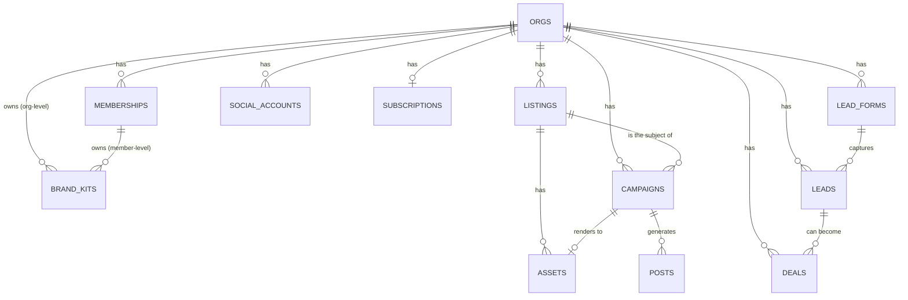

# Data Model

Entities as they exist in the Supabase Postgres schema today. This is a summary of what each table represents and how tables relate, not a column-by-column reference — the migration files in `supabase/migrations/` are the schema of record; read them for exact columns, types, and constraints.
Source: `supabase/migrations/0001_init.sql` through `0022_lead_form_packet.sql` (23 migrations)

## Entity relationships

Source: `supabase/migrations/0001_init.sql`, `0011_lead_capture.sql`, `0012_revenue_attribution.sql`

## Core entities

**`orgs`** — the tenant boundary. Every other table scopes to one `org_id`. A solo agent's signup auto-creates an `org` with `is_solo = true`, so a brokerage and a single agent are the same underlying concept at different membership counts.
Source: `supabase/migrations/0001_init.sql`

**`memberships`** — links a Supabase Auth user to an org with a role (`owner`, `admin`, `member`). Row Level Security is enforced through the `is_org_member`/`is_org_admin` SQL helper functions defined alongside this table, which most other tables' policies call.
Source: `supabase/migrations/0001_init.sql`

**`profiles`** — one row per individual user (not per org membership): name, license number, headshot, contact block. Independent of which org(s) the user belongs to.
Source: `supabase/migrations/0001_init.sql`

**`brand_kits`** — colors, fonts, logos, disclaimer text, and a `locked_fields` list. Owned by either an org (brokerage-wide, can lock fields so members can't override them) or a membership (a solo agent's own kit, or a member's personal layer on top of an unlocked org kit). `lib/branding/resolveBrand.ts` is the single place that merges org + member brand into what templates actually render.
Source: `supabase/migrations/0001_init.sql`, `lib/branding/resolveBrand.ts`

**`listings`** — an address plus price/beds/baths/sqft/status, created by a user within an org. Can be manually entered or imported from RentCast (MLS data); see `docs/INTEGRATIONS.md`.
Source: `supabase/migrations/0001_init.sql`, `lib/listings/rentcast.ts`

**`assets`** — a stored file (photo, AI-enhanced photo, or rendered graphic) in the private `media` Supabase Storage bucket, optionally tied to a listing.
Source: `supabase/migrations/0001_init.sql`

**`campaigns`** — a generated content package for one listing: type (`just_sold`, `new_listing`, `open_house`, `custom`), the AI-generated `copy` JSON (headline, caption, CTA, hashtags, and `compliance_notes` — the Fair Housing gate's data source, see `docs/INTEGRATIONS.md` and `SECURITY.md`), which brand kit was used, and the rendered asset.
Source: `supabase/migrations/0001_init.sql`

**`posts`** — one social-platform-specific post derived from a campaign: platform, caption, media paths, schedule time, and a state machine (`draft → approved → scheduled → published`, or `failed`). This is what the publish queue and cron jobs operate on.
Source: `supabase/migrations/0001_init.sql`, `lib/social/publish.ts`

**`social_accounts`** — OAuth tokens (encrypted at the application layer before storage — see `lib/social/crypto.ts`) for a connected Instagram/Facebook/LinkedIn/X account, owned at the org or member level.
Source: `supabase/migrations/0001_init.sql`, `lib/social/crypto.ts`

**`recurring_jobs`**, **`trends`**, **`agent_runs`** — automation and audit: scheduled recurring content jobs (local-market/trend posts), detected trend data, and a log of AI agent invocations.
Source: `supabase/migrations/0001_init.sql`

## Billing

**`subscriptions`** — one row per org (`unique(org_id)`), mirroring the org's Stripe subscription: plan, status, current period end, seat count. `plan`/`status` are the system of record for gating features in the app; Stripe is the system of record for the subscription's actual billing state, kept in sync via webhooks.
Source: `supabase/migrations/0006_billing.sql`, `app/api/webhooks/stripe/route.ts`

**`usage_records`** — metered usage events (AI generation, video render, SMS, image generation) per org, used for plan credit accounting.
Source: `supabase/migrations/0006_billing.sql`

**`billing_events`** — raw Stripe webhook payloads keyed by `stripe_event_id` for idempotent processing and audit.
Source: `supabase/migrations/0006_billing.sql`

## Lead capture and revenue attribution

**`lead_forms`** — a public landing-page form (general, open-house, or listing-specific), each with a unique slug, optionally tied to a listing or a `marketing_campaigns` row.
Source: `supabase/migrations/0011_lead_capture.sql`

**`leads`** — a captured contact (name/email/phone/message), sourced from a landing page, open-house sign-in, QR code, or manual entry, with a status pipeline (`new → contacted → qualified → won/lost`).
Source: `supabase/migrations/0011_lead_capture.sql`

**`deals`** — an opportunity derived from a lead, with a stage pipeline (`prospect → appointment → agreement → under_contract → closed_won/closed_lost`) and a `value` field representing expected or closed commission (GCI). This is the revenue side of "post → click → lead → deal" attribution.
Source: `supabase/migrations/0012_revenue_attribution.sql`

**`tracked_links`** — a shortened, click-counted URL tied to a campaign, used to attribute clicks back to a specific piece of content.
Source: `supabase/migrations/0012_revenue_attribution.sql`

## Other tables present but not detailed here

`marketing_campaigns`, `campaign_messages` (email/SMS content type), `social_metrics` (engagement snapshot framework — populates once each platform's insights API access is approved), `feedback` (in-app feedback, optionally mirrored to Notion — see `docs/INTEGRATIONS.md`), `org_invite_tokens` (white-labeled agent invite links). UNVERIFIED: full column-level detail for these was not traced in this pass; the migration files that create them (`0009_campaign_object.sql`, `0010_social_metrics.sql`, `0017_support_feedback.sql`, `0021_invite_tokens.sql`) are the source of record.

## Which system owns what

The Supabase database is the system of record for all application data. Stripe is the system of record for actual subscription billing state and payment history; `subscriptions`/`usage_records`/`billing_events` are a synced mirror kept current by webhooks, not an independent source of truth. RentCast is the system of record for MLS listing data when a listing is imported rather than manually entered; `listings` rows created that way are a snapshot, not a live sync (see `docs/INTEGRATIONS.md` for refresh behavior).

## Retention

UNKNOWN: no retention policy for leads, deals, campaigns, or posts was found in the schema, migrations, or docs. Nothing currently deletes old rows automatically.
